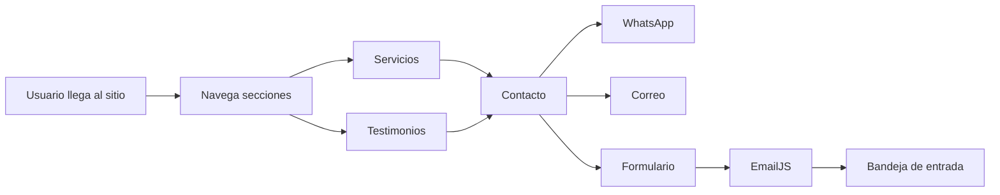
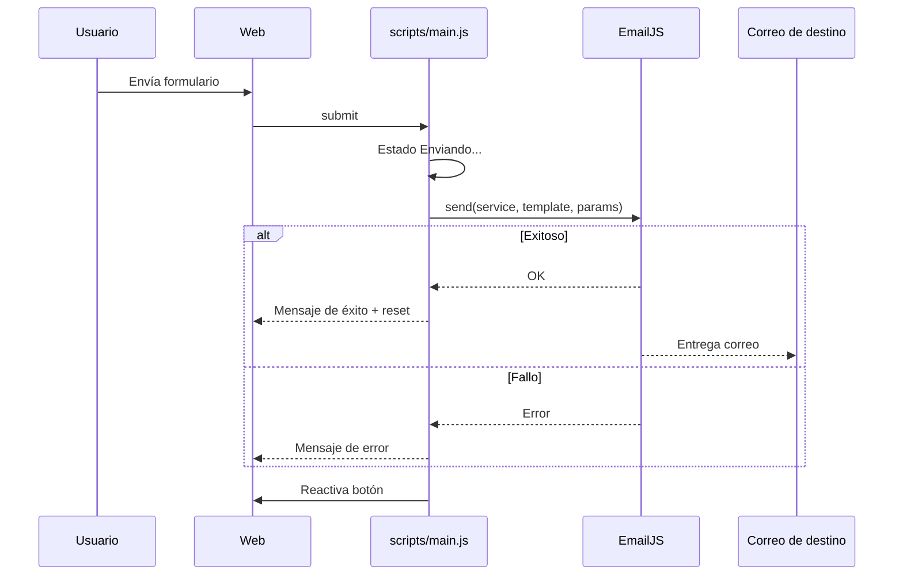
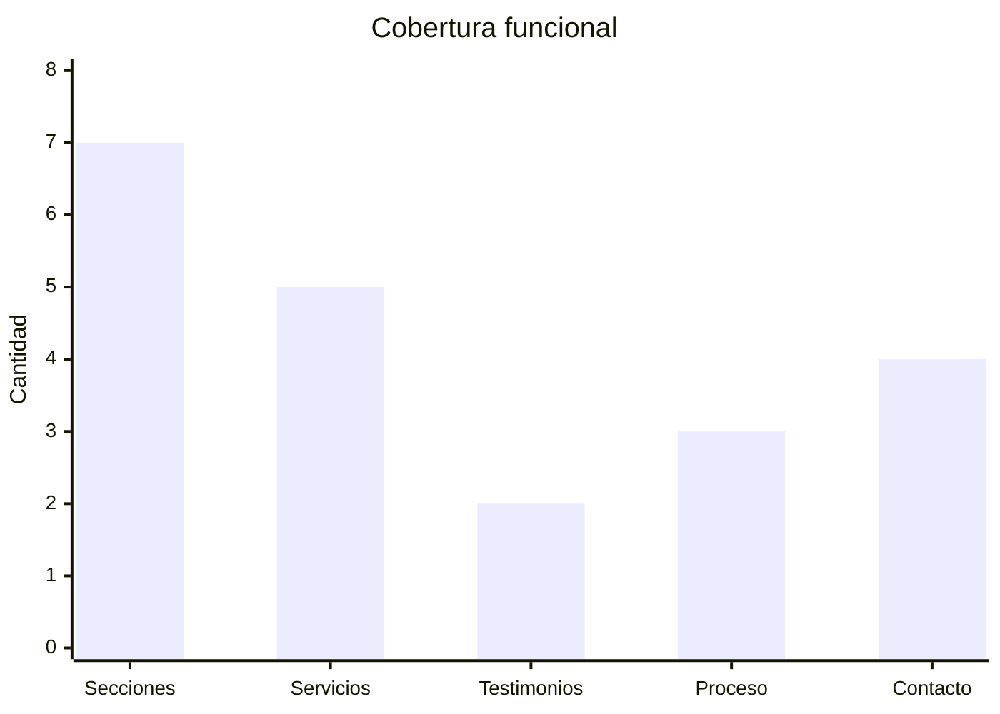

<div align="center">
	
	<h1>Virgen Abogados App</h1>
	<p><strong>Landing legal profesional</strong> enfocada en confianza, claridad y conversión de clientes.</p>

	<p>
		
		
		
		
	</p>
</div>

---

## Navegación Rápida

1. [Vista del producto](#vista-del-producto)
2. [Experiencia de interfaz](#experiencia-de-interfaz)
3. [Arquitectura visual](#arquitectura-visual)
4. [Métricas del sitio](#métricas-del-sitio)
5. [Estructura del proyecto](#estructura-del-proyecto)
6. [Guía local](#guía-local)
7. [Formulario con EmailJS](#formulario-con-emailjs)
8. [Personalización de diseño](#personalización-de-diseño)
9. [Despliegue](#despliegue)

## Vista del producto

<table>
	<tr>
		<td width="50%" valign="top">
			<h3>Objetivo</h3>
			<p>Presentar a Virgen Abogados con una imagen sólida y elegante, facilitando el contacto por varios canales sin fricción.</p>
			<h3>Resultado</h3>
			<p>Landing one-page con identidad de marca, servicios, proceso de trabajo, prueba social y formulario activo.</p>
		</td>
		<td width="50%" valign="top">
			<h3>Canales de conversión</h3>
			<ul>
				<li>WhatsApp directo</li>
				<li>Correo electrónico</li>
				<li>Formulario integrado con EmailJS</li>
				<li>Instagram profesional</li>
			</ul>
		</td>
	</tr>
</table>

## Experiencia de interfaz

<table>
	<tr>
		<th>Bloque</th>
		<th>Propósito UX</th>
		<th>Valor para el cliente</th>
	</tr>
	<tr>
		<td>Hero de marca</td>
		<td>Comunicar posicionamiento legal premium</td>
		<td>Primera impresión sólida y confiable</td>
	</tr>
	<tr>
		<td>Perfil profesional</td>
		<td>Mostrar trayectoria y enfoque humano</td>
		<td>Genera credibilidad</td>
	</tr>
	<tr>
		<td>Servicios en tarjetas</td>
		<td>Lectura rápida de especialidades</td>
		<td>Identifica si el bufete cubre su necesidad</td>
	</tr>
	<tr>
		<td>Proceso de trabajo</td>
		<td>Reducir incertidumbre del usuario</td>
		<td>Expectativas claras del servicio</td>
	</tr>
	<tr>
		<td>Testimonios</td>
		<td>Prueba social</td>
		<td>Incrementa confianza antes de contactar</td>
	</tr>
	<tr>
		<td>Formulario + accesos directos</td>
		<td>Eliminar fricción de contacto</td>
		<td>Mejora tasa de conversión</td>
	</tr>
</table>

## Arquitectura visual

### Flujo general del sitio



### Flujo del formulario



## Métricas del sitio

- Secciones principales: 7
- Servicios publicados: 5
- Testimonios: 2
- Pasos del proceso: 3
- Canales de contacto: 4



## Estructura del proyecto

```text
VirgenAbogadosApp/
|-- index.html
|-- README.md
|-- assets/
|   |-- Firma Correo.html
|   |-- logo-va.png
|   `-- diana-posada-virgen.jpeg
|-- scripts/
|   `-- main.js
`-- styles/
		`-- main.css
```

## Guía local

1. Abre el proyecto en VS Code.
2. Ejecuta con una de estas opciones:
	 - Abrir index.html en navegador.
	 - Usar Live Server para recarga automática.
3. Validar en desktop y móvil.

## Formulario con EmailJS

El formulario usa EmailJS desde scripts/main.js con:

- EMAILJS_PUBLIC_KEY
- EMAILJS_SERVICE_ID
- EMAILJS_TEMPLATE_ID

Campos que envía:

- from_name
- from_email
- from_phone
- message
- sent_at

Pasos para configurar en otra cuenta:

1. Crear servicio y plantilla en EmailJS.
2. Reemplazar claves en scripts/main.js.
3. Hacer prueba de envío real.

## Personalización de diseño

<table>
	<tr>
		<th>Qué cambiar</th>
		<th>Dónde</th>
	</tr>
	<tr>
		<td>Textos, enlaces y datos de contacto</td>
		<td>index.html</td>
	</tr>
	<tr>
		<td>Paleta, tipografía, espaciados y componentes</td>
		<td>styles/main.css</td>
	</tr>
	<tr>
		<td>Comportamiento del menú y formulario</td>
		<td>scripts/main.js</td>
	</tr>
	<tr>
		<td>Logo y fotografía profesional</td>
		<td>assets/</td>
	</tr>
</table>

## Despliegue

Opciones sugeridas:

- Netlify
- Vercel
- GitHub Pages

Flujo recomendado:

1. Publicar repositorio en GitHub.
2. Conectar el repo al hosting.
3. Configurar dominio personalizado.
4. Verificar HTTPS y formulario en producción.

---

Desarrollado para presencia digital legal en Itagüí, Antioquia, con enfoque en confianza de marca y conversión de contactos.